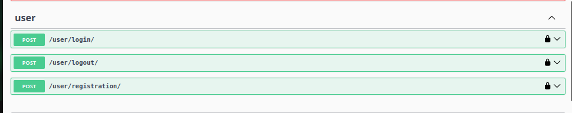
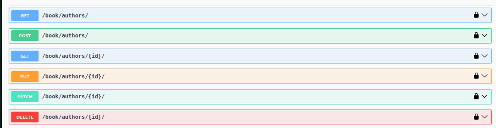
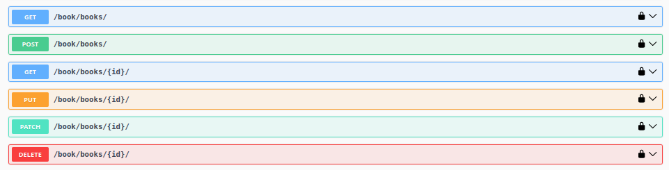
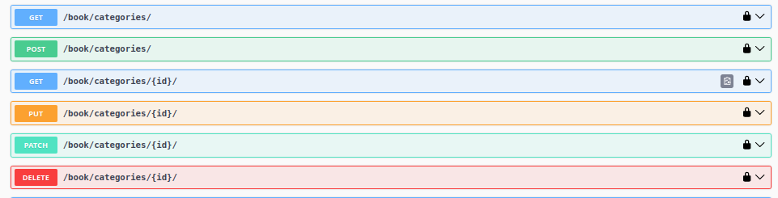
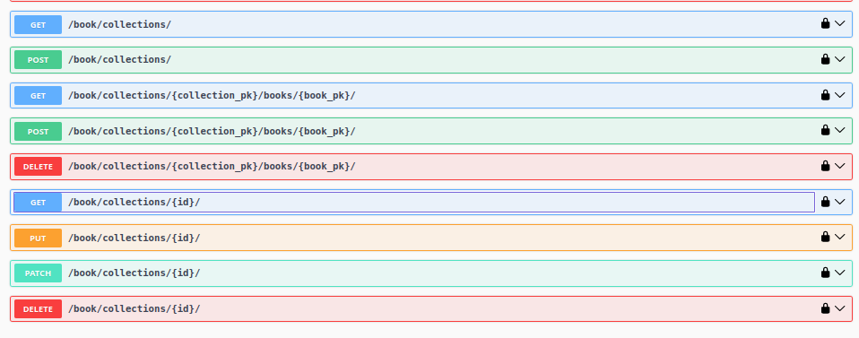

<div align="center">
    
</div>


<?xml version="1.0" encoding="UTF-8"?>
<svg xmlns="http://www.w3.org/2000/svg" width="99" height="20">
    <linearGradient id="b" x2="0" y2="100%">
        <stop offset="0" stop-color="#bbb" stop-opacity=".1"/>
        <stop offset="1" stop-opacity=".1"/>
    </linearGradient>
    <mask id="a">
        <rect width="99" height="20" rx="3" fill="#fff"/>
    </mask>
    <g mask="url(#a)">
        <path fill="#555" d="M0 0h63v20H0z"/>
        <path fill="#a4a61d" d="M63 0h36v20H63z"/>
        <path fill="url(#b)" d="M0 0h99v20H0z"/>
    </g>
    <g fill="#fff" text-anchor="middle" font-family="DejaVu Sans,Verdana,Geneva,sans-serif" font-size="11">
        <text x="31.5" y="15" fill="#010101" fill-opacity=".3">coverage</text>
        <text x="31.5" y="14">coverage</text>
        <text x="80" y="15" fill="#010101" fill-opacity=".3">82%</text>
        <text x="80" y="14">82%</text>
    </g>
</svg>


 # Librarium - Biblioteca Virtual  

**Librarium** é um sistema de biblioteca virtual projetado para facilitar a organização e consulta de livros de forma intuitiva e personalizada.  

## Funcionalidades Principais  

- **Coleções Pessoais**:  
  Cada usuário pode criar e gerenciar suas próprias coleções de livros, organizando os títulos de acordo com suas preferências. Essas coleções são exclusivas, ou seja, apenas o criador pode editá-las, enquanto os demais usuários têm acesso somente para visualização.  

- **Administração de Conteúdo**:  
  O administrador do sistema é responsável por cadastrar e gerenciar os livros, autores e categorias disponíveis na plataforma, garantindo que o acervo esteja sempre atualizado.  

## Objetivo do Projeto  

O Librarium busca unir praticidade e personalização, permitindo que cada usuário organize os livros de maneira que melhor atenda às suas necessidades enquanto mantém um ambiente centralizado e bem administrado para todos os participantes.

## Funcionalidades


### Pré-requisitos

Antes de começar, você vai precisar ter instalado em sua máquina Python 3.10 ou qualquer versão acima. Além disso, é bom ter um editor para trabalhar com o código, como [VSCode](https://code.visualstudio.com/).
Em relação ao banco de dados, sugiro que você trabalhe com o PostgreSQL

### 🎲 Rodando o Back End (servidor)

```bash
# Clone este repositório
$ git clone https://github.com/CaosFera/Librarium.git

# 1. Acesse a pasta do projeto
$ cd Librarium

# 2. Crie e ative o ambiente virtual (virtualenv)
$ python -m venv venv
$ source venv/bin/activate  # Linux e Mac
$ venv\Scripts\Activate  # Windows

# 3. Instale as dependências do projeto
$ pip install -r requirements.txt

# 4. Execute as migrações do banco de dados
$ python manage.py migrate

# 5. Crie um superusuário para acessar o admin do Django
$ python manage.py createsuperuser

# 6. Execute o servidor em modo de desenvolvimento
$ python manage.py runserver

# O servidor inciará na porta:8000 - acesse <http://localhost:8000>
```
### Aqui estão as principais rotas da API:

### Autenticação de Usuários
- **POST /user/login/**
- Loga um usuário previamente cadastrado
- **Resposta:** Status 200.

```json
{
    "username": "string",
    "email": "user@example.com",
    "password": "string"
}
```


- **POST /user/logout/**
- Desconecta um usuário do sistema.
- **Resposta:** Status 200.
```json
{
  "detail": "Successfully logged out."
}
```
- **POST /user/registration/**
- Cadastra um novo usuário no sistema.
- **Resposta:** Status 201.
```json

 {
    "username": "string",
    "email": "user@example.com",
    "password1": "string",
    "password2": "string",
    "first_name": "string",
    "last_name": "string"
}

```

<div align="center">
    
</div>

### CRUD de Autores
Usuários não administradores terão acesso apenas aos métodos GET, HEAD e OPTIONS.

- **GET /book/authors/**
  - Retorna uma lista de autores.
  - **Resposta:** Status 200 com uma lista de livros no formato JSON.
  - **Exemplo de resposta:**
    ```json
    [
        {
            "id": 1,
            "name": "Clarice Lispector"
        },
        {
            "id": 2,
            "name": "J. R. R. Tokken"
        },
        {
            "id": 4,
            "name": "Paulo Coelho"
        }
    ]
    ```

- **POST /book/authors/**
  - Cria um novo autor. 
  - **Permissões:** Somente administradores podem criar autores.
  -  **Resposta de sucesso:** Status 201.
  - Requer um corpo de requisição com os campos:
  ```json
        {
            "name": "string"
        }
  ```
 

- **GET /book/authors/{id}/**
  - Retorna os detalhes de um autor específico, baseado no `id`.
  - **Resposta de sucesso:** Status 200.
  - **Permissões:** Somente usuários autenticados podem visualizar autores.
    ```json
       {
        "id": 2,
        "name": "J. R. R. Tokken"
        }
    ```

- **PUT /book/authors/{id}/**
  - Atualiza as informações de um autor existente, baseado no `id`.
  - **Resposta de sucesso:** Status 200
  - **Permissões:** Somente administradores podem atualizar autores.
    ```json
        {
            "name": "string"
        }
    ```
   **PATCH /book/authors/{id}/**
  - Atualiza parcialmente as informações de um autor existente, baseado no `id`.
  - **Resposta de sucesso:** Status 200.
  - **Permissões:** Somente administradores podem atualizar livros.
    ```json
        {
            "name": "string"
        }
    ```
- **DELETE /book/authors/{id}/**
  - Remove um autor do banco de dados.
  - Um autor não pode ser removidado caso tenha um ou mais livros relacionados ao mesmo (on_delete=models.PROTECT).
  - **Resposta de sucesso:** Status 204. 
  - **Permissões:** Somente administradores podem excluir autores.

<div align="center">
    
</div>


## CRUD de Livros
Usuários não administradores terão acesso apenas aos métodos GET, HEAD e OPTIONS.

- **GET /book/books/**
  - Retorna uma lista de livros.
  - **Resposta:** Status 200 com uma lista de livros no formato JSON.
  - **Exemplo de resposta:**
    ```json
    [
            {
            "id": 10,
            "title": "A História da Terra-média ",
            "author": 2,
            "category": 2,
            "published_on": "18/11/2024"
        },
        {
            "id": 9,
            "title": "A Queda de Gondolin",
            "author": 2,
            "category": 2,
            "published_on": "18/11/2024"
        },
        {
            "id": 15,
            "title": "Brida decide morrer",
            "author": 4,
            "category": 4,
            "published_on": "20/11/2024"
        },
        {
            "id": 12,
            "title": "Contos Inacabados de Númenor e da Terra-média",
            "author": 2,
            "category": 2,
            "published_on": "18/11/2024"
        },
        {
            "id": 11,
            "title": "Filhos de Húrin",
            "author": 2,
            "category": 2,
            "published_on": "18/11/2024"
        },
        {
            "id": 7,
            "title": "O Hobbit",
            "author": 2,
            "category": 2,
            "published_on": "18/11/2024"
        },
    ]
    ```

- **POST /book/books/**
  - Cria um novo livro. 
  - **Permissões:** Somente administradores podem criar livros.
  -  **Resposta de sucesso:** Status 201: Livro criado com sucesso
  - Requer um corpo de requisição com os campos:
  ```json
       {
        "title": "string",
        "author": 0,
        "category": 0,
        "published_on": "2024-11-21"
        }

  ```
 

- **GET /book/books/{id}/**
  - Retorna os detalhes de um livro específico, baseado no `id`.
  - **Resposta de sucesso:** Status 200
  - **Permissões:** Somente usuários autenticados podem visualizar livros.
    ```json
        {
        "id": 4,
        "title": "O Senhor dos Anéis - As Duas Torres",
        "author": 2,
        "category": 2,
        "published_on": "15/11/2020"
        }
    ```

- **PUT /book/books/{id}/**
  - Atualiza as informações de um livro existente.
  - **Resposta de sucesso:** Status 200
  - **Permissões:** Somente administradores podem atualizar livros.
    ```json
        {
        "title": "string",
        "author": 0,
        "category": 0,
        "published_on": "2024-11-21"
        }
    ```
   **PATCH /book/books/{id}/**
  - Atualiza parcialmente as informações de um livro existente, baseado no `id`.
  - **Resposta de sucesso:** Status 200.
  - **Permissões:** Somente administradores podem atualizar livros.
    ```json
        {
        "title": "string",
        "author": 0,
        "category": 0,
        "published_on": "2024-11-21"
        }
    ```


- **DELETE /book/books/{id}/**
  - Remove um livro do banco de dados.
  - **Resposta de sucesso:** Status 204. 
  - **Permissões:** Somente administradores podem excluir livros.

<div align="center">
    
</div>


### CRUD de Categorias
Usuários não administradores terão acesso apenas aos métodos GET, HEAD e OPTIONS.

- **GET /book/categories/**
  - Retorna uma lista de categorias.
  - **Permissões:** Somente usuários autenticados podem visualizar lista de categorias.
  - **Resposta de sucesso:** Status 200. 
    ```json
    [
        {
            "id": 2,
            "name": "Aventura"
        },
        {
            "id": 4,
            "name": "Horror"
        },
        {
            "id": 1,
            "name": "Ficção"
        },
        {
            "id": 8,
            "name": "Novela"
        }
    ]
    ```

- **POST /book/categories/**
  - Cria uma nova categoria. 
  - **Permissões:** Somente administradores podem criar categorias.
  -  **Resposta de sucesso:** Status 201.
  - Requer um corpo de requisição com os campos:
  ```json
        {
            "name": "string"
        }
  ```
 

- **GET /book/categories/{id}/**
  - Retorna os detalhes de uma categoria específica, baseada no `id`.
  - **Resposta de sucesso:** Status 200.
  - **Permissões:** Somente usuários autenticados podem visualizar categorias.
    ```json
       {
        "id": 2,
        "name": "Aventura"
        }
    ```

- **PUT /book/categories/{id}/**
  - Atualiza as informações de uma categoria existente, baseado no `id`.
  - **Resposta de sucesso:** Status 200
  - **Permissões:** Somente administradores podem atualizar categorias.
    ```json
        {
            "name": "string"
        }
    ```
   **PATCH /book/categories/{id}/**
  - Atualiza parcialmente as informações de uma categoria existente, baseado no `id`.
  - **Resposta de sucesso:** Status 200.
  - **Permissões:** Somente administradores podem atualizar livros.
    ```json
        {
            "name": "string"
        }
    ```
- **DELETE /book/categories/{id}/**
  - Remove uma categoria do banco de dados, baseado no `id`.
  - Categorias não podem ser excluídas caso tenha um ou mais livros relacionada a mesma (on_delete=models.PROTECT).
  - **Resposta de sucesso:** Status 204. 
  - **Permissões:** Somente administradores podem excluir categorias.

<div align="center">
    
</div>


### CRUD de Coleções  

- **Criação e Visualização**:  
  Todos os usuários autenticados podem criar suas próprias coleções e visualizar as coleções de outros usuários.  

- **Restrições para Usuários Anônimos**:  
  Usuários não autenticados não têm permissão para criar ou visualizar coleções.  

- **Acesso às Coleções**:  
  As coleções criadas por um usuário podem ser visualizadas por outros usuários através dos métodos HTTP **GET**, **HEAD** e **OPTIONS**, mas não podem ser modificadas (**POST**, **DELETE**, **PUT** ou **PATCH**) por terceiros.  

- **GET /book/collections/**
  - Retorna uma lista de coleções.
  - **Permissões:** Somente usuários autenticados podem visualizar lista de coleções.
  - **Resposta de sucesso:** Status 200. 
    ```json
    [

        {
            "id": 5,
            "name": "CEPEDI",
            "description": "Apostilas Backend Python/Django",
            "books": [],
            "collector_id": 3,
            "collector_username": "joao_silva"
        },
        {
            "id": 9,
            "name": "Clássicos da Literatura Universal",
            "description": "Filosofia, Antropologia, Psicologia, etc",
            "books": [],
            "collector_id": 4,
            "collector_username": "Borges"
        },
        {
            "id": 11,
            "name": "Mais Uma Coleção do Admin",
            "description": "Livros de Hipnose",
            "books": [],
            "collector_id": 4,
            "collector_username": "Borges"
        },
        {
            "id": 6,
            "name": "Sistemas Embarcados",
            "description": "Linguagem C, Hardware, Sistemas Operacionais",
            "books": [
            7
            ],
            "collector_id": 1,
            "collector_username": "Ed"
        },
        
    ]
    ```

- **POST /book/collections/**
  - Cria uma nova coleção associada ao usuário que fez a requisição (request.user). 
  - **Permissões:** Somente usuários logados  podem criar coleções.
  -  **Resposta de sucesso:** Status 201.
  - Requer um corpo de requisição com os campos:
    ```json
        {
            "name": "string",
            "description": "string"
        }
    ```
- **GET /book/collections/{collection_pk}/books/{book_pk}/**
- Retorna um determinado livro de uma determinada coleções.
- **Permissões:** Basta está autenticado pra ter acesso.
-  **Resposta de sucesso:** Status 200.

```json
    {
        "id": 7,
        "title": "O Hobbit",
        "author": 2,
        "published_on": "2024-11-18"
    }

  ```


- **POST /book/collections/{collection_pk}/books/{book_pk}/**
- Adiciona um livro à uma coleção, é necessário informar os respectivos IDs de coleção e livro.
- **Permissões:** Somente o dono da coleção pode alterá-la.
-  **Resposta de sucesso:** Status 201.

```json
    {
      "detail": "O livro 'O Senhor dos Anéis - A Sociedade do Anel' foi adicionado à coleção com sucesso."
    }

  ```
- **DELETE /book/collections/{collection_pk}/books/{book_pk}/**
- Exclue um livro de uma coleção, é necessário informar os respectivos IDs de coleção e livro.
- **Permissões:** Somente o dono da coleção pode alterá-la.
-  **Resposta de sucesso:** Status 204.


- **GET /book/collections/{id}/**
  - Retorna os detalhes de uma coleção específica, baseada no `id`.
  - **Resposta de sucesso:** Status 200.
  - **Permissões:** Somente usuários autenticados podem visualizar coleções.
    ```json
      {
            "id": 6,
            "name": "Sistemas Embarcados",
            "description": "Linguagem C, Hardware, Sistemas Operacionais",
            "books": [
                7
            ],
            "collector_id": 1,
            "collector_username": "Ed"
        }
    ```

- **PUT /book/collections/{id}/**
  - Atualiza as informações de uma coleção existente, baseado no `id`.
  - **Resposta de sucesso:** Status 200
  - **Permissões:** Somente o dono da coleção pode atualizá-la.
     ```json
        {
            "name": "string",
            "description": "string"
        }
    ```
   **PATCH /book/collections/{id}/**
  - Atualiza parcialmente as informações de uma coleção existente, baseado no `id`.
  - **Resposta de sucesso:** Status 200.
  - **Permissões:** Somente o dono da coleção pode atualizá-la.
     ```json
        {
            "name": "string",
            "description": "string"
        }
    ```
- **DELETE /book/collections/{id}/**
  - Remove uma coleção do banco de dados, baseado no `id`. 
  - **Resposta de sucesso:** Status 204. 
  - **Permissões:** Somente o dono da coleção pode excluí-la.

<div align="center">
    
</div>


🛠️ Tecnologias Utilizadas:

   ### Backend
- **Django**: [Documentação oficial do Django](https://docs.djangoproject.com/)
- **Django Rest Framework**: [Documentação oficial do Django Rest Framework](https://www.django-rest-framework.org/)

### Banco de Dados
- **PostgreSQL**: [Documentação oficial do PostgreSQL](https://www.postgresql.org/docs/)

### Principais Bibliotecas

- **dj-rest-auth**: [Autenticação de usuários com dj-rest-auth](https://dj-rest-auth.readthedocs.io/)
- **Django**: [Framework web com Django](https://docs.djangoproject.com/)
- **django-allauth**: [Autenticação de usuários com django-allauth](https://docs.allauth.org/)
- **djangorestframework**: [API REST com Django REST Framework](https://www.django-rest-framework.org/)
- **drf-spectacular**: [Documentação de API com DRF Spectacular](https://drf-spectacular.readthedocs.io/)
- **psycopg2-binary**: [Driver PostgreSQL para Python](https://www.psycopg.org/docs/)


## Observação sobre o Banco de Dados

Este projeto foi configurado para usar o PostgreSQL em produção, mas você pode optar por usar o SQLite durante a avaliação, caso não deseje configurar o PostgreSQL. Para isso, substitua as configurações do banco de dados no arquivo `settings.py` pelas seguintes:

```python
DATABASES = {
    'default': {
        'ENGINE': 'django.db.backends.sqlite3',
        'NAME': BASE_DIR / 'db.sqlite3',
    }
}
```

### Por que essa opção?

- **SQLite** é o banco de dados padrão do Django e não requer instalação ou configuração adicional.
- Ele é ideal para desenvolvimento local e testes rápidos.
- Essa abordagem elimina a necessidade de criar um banco de dados PostgreSQL, configurar usuários, senhas, e gerenciar conexões.
- Lembre de realizar as migrações.
